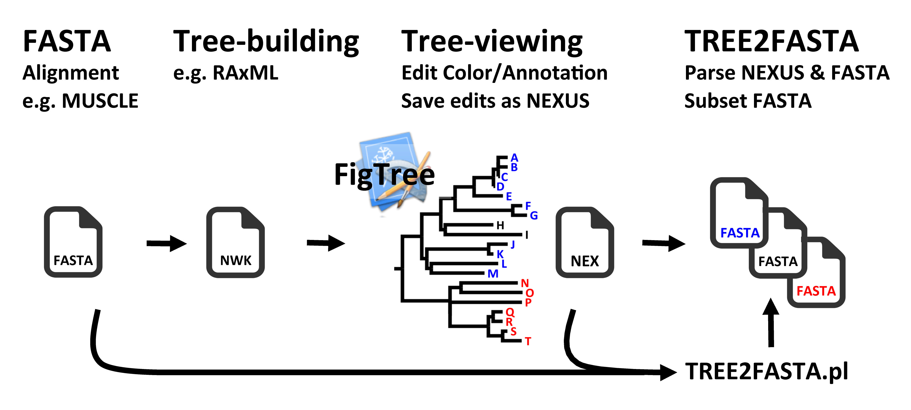
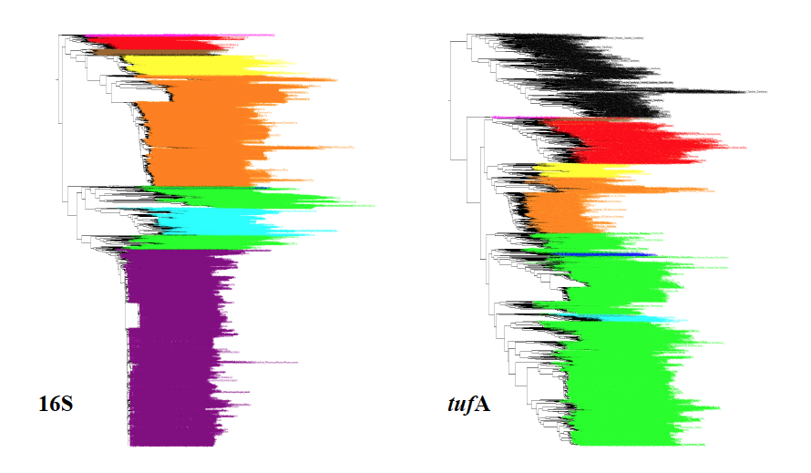

TREE2FASTA allows for the interactive, flexible and rapid sorting of FASTA sequences from clades of interest with minimal user efforts via tree edits in the popular tree-viewer FigTree.

To run TREE2FASTA you need the FASTA file you used to build your exploratory tree, and the edited version of that tree saved from FigTree (with taxa edited for color and/or annotation).



See our FigTree tutorial [here](FigTree_Tutorial.pdf)

# TREE2FASTA usage

**1) Navigate with the terminal to the desired working directory**

```
cd   path_to_working_directory
```

**Place TREE2FASTA.pl, the edited tree file and the FASTA file in this working directory
(or indicate the paths to the location of the script and files in the command line).** 

**2) Run TREE2FASTA as follows:**

```
perl   TREE2FASTA.pl   tre_file_name   fasta_file_name
``` 

**Example command line with example files provided**

```
perl   TREE2FASTA.pl   example_tree.tre   example_fasta.fas
```

**To see command line usage for TREE2FASTA, type:**

```
perl   TREE2FASTA.pl
```

# Input

**TREE file:**

Andrew Rambaut’s FigTree is required to edit exploratory trees as input for TREE2FASTA (see our [tutorial](FigTree_Tutorial.pdf)).
FigTree is available at http://tree.bio.ed.ac.uk/software/figtree

**FASTA file:**

FASTA sequence names in the FASTA file should match those in the exploratory tree (newick string).   
We recommend using the RAxML tree-building program, which will preserve the sequence header format from FASTA input to Newick string (tree) output. Some support is available to correct character discrepancies found in newick strings saved from MEGA (presence/absence of underscore characters in sequence names). TREE2FASTA will print sequence header discrepancies to help any troubleshooting.

**Size:**

TREE2FASTA can sort FASTA data from 1000+ sequence edited trees in seconds.



# Perl version

TREE2FASTA.pl was written in Perl v5.24.0 with basic syntax and does not require the installation of specific modules to run

# OS

TREE2FASTA can be run on Linux, Mac or Windows OS with Perl installed. 

# Citation

Sauvage T, Plouviez P, Schmidt WE, Fredericq S. (2018) **TREE2FASTA: A flexible Perl script for batch extraction of FASTA sequences from exploratory phylogenetic trees.** _BMC Research Note_ 11:164. DOI:10.1186/s13104-018-3268-y

Associated script version:

[](https://zenodo.org/badge/latestdoi/122100035)
